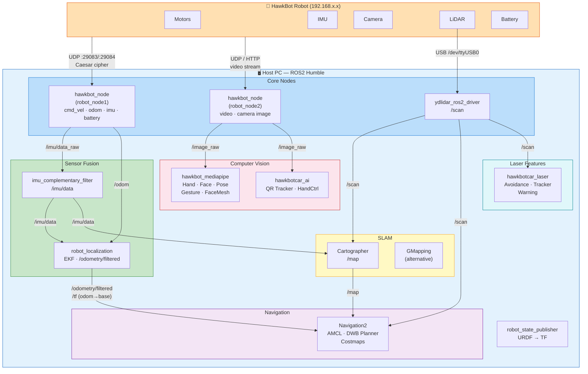

# HawkBot ROS2 Project

A ROS2 Humble-based robotics project for the HawkBot differential-drive robot, featuring SLAM, autonomous navigation, computer vision (MediaPipe), and teleoperation capabilities.

## Table of Contents

- [System Requirements](#system-requirements)
- [Architecture Overview](#architecture-overview)
- [Installation](#installation)
  - [1. Install ROS2 Humble](#1-install-ros2-humble)
  - [2. Install System Dependencies](#2-install-system-dependencies)
  - [3. Install YDLidar SDK](#3-install-ydlidar-sdk)
  - [4. Clone and Build the Workspace](#4-clone-and-build-the-workspace)
- [Package Descriptions](#package-descriptions)
- [Robot Communication Protocol](#robot-communication-protocol)
- [Usage](#usage)
  - [Bringup (Start the Robot)](#bringup-start-the-robot)
  - [Teleoperation (Keyboard Control)](#teleoperation-keyboard-control)
  - [SLAM (Mapping)](#slam-mapping)
  - [Autonomous Navigation](#autonomous-navigation)
  - [Computer Vision](#computer-vision)
  - [Laser-based Features](#laser-based-features)
  - [Sound / Melody Playback](#sound--melody-playback)
- [Custom Messages](#custom-messages)
- [Frame Reference](#frame-reference)
- [Configuration Files](#configuration-files)
- [Troubleshooting](#troubleshooting)

---

## System Requirements

| Component       | Requirement                        |
|-----------------|------------------------------------|
| OS              | Ubuntu 22.04 LTS (Jammy Jellyfish) |
| ROS2            | Humble Hawksbill                   |
| Python          | 3.10+                              |
| CMake           | 3.22+                              |
| RAM             | 4 GB minimum (8 GB recommended)    |
| Robot Hardware  | HawkBot with WiFi, LiDAR, IMU, Camera |

---

## Architecture Overview



---

## Installation

### Quick Install (All-in-One)

Run the bundled install script to set up everything automatically:

```bash
git clone https://github.com/duy12i1i7/hawkbot.git

cd hawkbot
chmod +x install.sh
./install.sh
```

Options:
- `--skip-ros2` — Skip ROS2 Humble installation if already present
- `--skip-build` — Skip the colcon build step
- `--jobs N` — Limit parallel make jobs (use `--jobs 1` for low-RAM systems)

The script will automatically detect low RAM (<6 GB) and reduce build parallelism.

---

### Manual Installation (Step by Step)

### 1. Install ROS2 Humble

Follow the official guide: https://docs.ros.org/en/humble/Installation/Ubuntu-Install-Debs.html


### 2. Install System Dependencies

```bash
# Core ROS2 packages
sudo apt install -y \
  ros-humble-cartographer \
  ros-humble-cartographer-ros \
  ros-humble-navigation2 \
  ros-humble-nav2-bringup \
  ros-humble-robot-state-publisher \
  ros-humble-joint-state-publisher \
  ros-humble-xacro \
  ros-humble-tf2-ros \
  ros-humble-tf2-tools

# Build tools
sudo apt install -y \
  python3-colcon-common-extensions \
  python3-rosdep \
  python3-vcstool \
  cmake \
  build-essential

# Python dependencies
pip3 install opencv-python mediapipe numpy

# Initialize rosdep (if not done already)
sudo rosdep init 2>/dev/null || true
rosdep update
```

### 3. Install YDLidar SDK

The YDLidar SDK must be installed system-wide before building the ROS2 driver.

```bash
cd /tmp
git clone https://github.com/YDLIDAR/YDLidar-SDK.git
cd YDLidar-SDK
mkdir build && cd build
cmake ..
make -j$(nproc)
sudo make install
```

### 4. Clone and Build the Workspace

```bash
# Create workspace
mkdir -p ~/ROS2_WS/src
cd ~/ROS2_WS/src

# Clone the project (replace with your actual repository URL)

git clone https://github.com/duy12i1i7/hawkbot.git

# Clone additional dependencies that are not in apt
# ydlidar_ros2_driver
git clone -b humble https://github.com/YDLIDAR/ydlidar_ros2_driver.git

# imu_tools (provides imu_complementary_filter)
git clone -b humble https://github.com/CCNYRoboticsLab/imu_tools.git

# Build the workspace
cd ~/ROS2_WS
source /opt/ros/humble/setup.bash
colcon build --symlink-install

# Source the workspace
echo "source ~/ROS2_WS/install/setup.bash" >> ~/.bashrc
source ~/.bashrc
```

> **Note:** If you encounter OOM (Out of Memory) errors during C++ compilation (e.g., `robot_localization`), limit parallelism:
> ```bash
> MAKEFLAGS="-j1" colcon build --symlink-install --parallel-workers 1
> ```

### 5. Set Up LiDAR USB Permissions

```bash
# Add your user to the dialout group for serial port access
sudo usermod -a -G dialout $USER

# Create a udev rule for the YDLidar (optional, for persistent device name)
echo 'KERNEL=="ttyUSB*", ATTRS{idVendor}=="10c4", ATTRS{idProduct}=="ea60", MODE:="0666", GROUP:="dialout", SYMLINK+="ydlidar"' \
  | sudo tee /etc/udev/rules.d/ydlidar.rules
sudo udevadm control --reload-rules
sudo udevadm trigger

# Log out and back in for the group change to take effect
```

---

## Package Descriptions

| Package                | Type          | Description |
|------------------------|---------------|-------------|
| `hawkbot`              | ament_python  | Core robot node — motor control, odometry, IMU, battery, video via UDP protocol. Includes teleoperation and sound playback. |
| `hawkbot_cartographer` | ament_cmake   | SLAM configuration using Google Cartographer with LiDAR + IMU fusion. |
| `hawkbot_navigation2`  | ament_cmake   | Autonomous navigation using Nav2 stack (AMCL, DWB planner, costmaps). |
| `hawkbot_mediapipe`    | ament_python  | Computer vision nodes: hand/face/pose detection, gesture recognition, face mesh, virtual paint. |
| `hawkbotcar_ai`        | ament_python  | AI features: QR code tracking, hand gesture-based car control. |
| `hawkbotcar_laser`     | ament_python  | Laser-based obstacle avoidance, object tracking, and proximity warning. |
| `hawkbotcar_msgs`      | ament_cmake   | Custom ROS2 message definitions (ImageMsg, Position, Target, PointArray, TargetArray). |
| `ydlidar_ros2_driver`  | ament_cmake   | ROS2 driver for YDLidar 2D LiDAR sensors. |
| `imu_tools`            | ament_cmake   | IMU complementary filter and Madgwick filter for sensor fusion. |
| `robot_localization`   | ament_cmake   | Extended Kalman Filter (EKF) for fusing odometry + IMU into a smooth pose estimate. |
| `slam_gmapping`        | ament_cmake   | Alternative SLAM using GMapping (particle filter-based). |
| `openslam_gmapping`    | ament_cmake   | Core GMapping library used by slam_gmapping. |

---

## Robot Communication Protocol

The HawkBot communicates with the host PC over **WiFi using UDP** with a simple encrypted protocol.

| Parameter          | Value  |
|--------------------|--------|
| Control send port  | 29083  |
| Control recv port  | 29084  |
| LiDAR send port    | 18902  |
| LiDAR recv port    | 18903  |
| Encryption         | Caesar cipher (shift = 29) |
| Message format     | `#<SIGNAL><data>*` |

**Signal Codes:**

| Signal | Direction | Description |
|--------|-----------|-------------|
| `A`    | PC → Robot | Motor velocity command (cmd_vel) |
| `B`    | Both       | Odometry data / Sound command |
| `D`    | Both       | IMU data / PID parameters |
| `E`    | Both       | Battery state / Servo control |
| `G`    | Both       | Motor speed / Robot parameters |

---

## Usage

### Bringup (Start the Robot)

Connect to the same WiFi network as the robot, then launch:

```bash
# Standard bringup (replace IP with your robot's IP)
ros2 launch hawkbot bringup_launch.py ip:=192.168.0.132

# With custom camera quality (1-10, default: 7)
ros2 launch hawkbot bringup_launch.py ip:=192.168.0.132 cam_quality:=5

# Robot variant 03
ros2 launch hawkbot bringup03_launch.py ip:=192.168.0.132

# Robot variant 05
ros2 launch hawkbot bringup05_launch.py ip:=192.168.0.132
```

This starts:
- Two `hawkbot_node` processes (control + video)
- YDLidar driver on `/dev/ttyUSB0`
- IMU complementary filter
- Robot localization (EKF)
- Robot state publisher (URDF → TF)
- All necessary static transforms

### Teleoperation (Keyboard Control)

In a **separate terminal** (after bringup):

```bash
ros2 run hawkbot teleop_keyboard
```

**Keyboard bindings:**

```
   u    i    o
   j    k    l
   m    ,    .

i/k : forward / stop
j/l : turn left / turn right
u/o : forward-left / forward-right
m/. : backward-left / backward-right

w/x : increase / decrease linear speed (by 10%)
e/c : increase / decrease angular speed (by 10%)

CTRL+C to quit
```

Default speed: linear = 0.15 m/s, angular = 1.0 rad/s

### SLAM (Mapping)

First start the robot bringup, then in a separate terminal:

```bash
# Start Cartographer SLAM + RViz
ros2 launch hawkbot_cartographer cartographer.launch.py
```

Drive the robot around using teleoperation to build a map. When done, save the map:

```bash
# Save map to file
ros2 run nav2_map_server map_saver_cli -f ~/ROS2_WS/src/hawkbot/map/my_map
```

This produces `my_map.pgm` (image) and `my_map.yaml` (metadata).

### Autonomous Navigation

Requires a pre-built map. First start bringup, then:

```bash
# Standard navigation
ros2 launch hawkbot_navigation2 navigation2.launch.py

# Robot variant 03
ros2 launch hawkbot_navigation2 navigation2_03.launch.py

# Robot variant 05
ros2 launch hawkbot_navigation2 navigation2_05.launch.py
```

In RViz2:
1. Click **"2D Pose Estimate"** to set the robot's initial position on the map
2. Click **"Nav2 Goal"** to set a navigation goal

The default map is located at `hawkbot/map/hawkbot.yaml`.

### Computer Vision

**First-time setup:** Download the face detection model (~96 MB, excluded from git):

```bash
cd src/hawkbot_mediapipe/hawkbot_mediapipe/file/
wget http://dlib.net/files/shape_predictor_68_face_landmarks.dat.bz2
bzip2 -d shape_predictor_68_face_landmarks.dat.bz2
```

> **Note:** The `install.sh` script handles this automatically.

MediaPipe-based vision nodes (require camera stream from bringup):

```bash
# Hand detection
ros2 run hawkbot_mediapipe HandDetector

# Pose detection
ros2 run hawkbot_mediapipe PoseDetector

# Face mesh
ros2 run hawkbot_mediapipe FaceMesh

# Gesture recognition
ros2 run hawkbot_mediapipe GestureRecognition

# Hand-controlled car
ros2 run hawkbotcar_ai HandCtrlCar

# QR code tracker
ros2 run hawkbotcar_ai qrTracker
```

### Laser-based Features

```bash
# Obstacle avoidance (auto-drive avoiding obstacles)
ros2 run hawkbotcar_laser laser_Avoidance

# Object tracking with laser
ros2 run hawkbotcar_laser laser_Tracker

# Proximity warning
ros2 run hawkbotcar_laser laser_Warning
```

### Sound / Melody Playback

```bash
ros2 run hawkbot sound
```

Plays predefined melodies (e.g., Happy Birthday, Twinkle Twinkle Little Star) through the robot's buzzer.

---

## Custom Messages

Defined in `hawkbotcar_msgs`:

| Message        | Fields | Description |
|----------------|--------|-------------|
| `ImageMsg`     | `int32 height, width, channels; uint8[] data` | Raw image data |
| `Position`     | `float32 anglex, angley, distance` | Object position (angles + distance) |
| `Target`       | `string frame_id; Time stamp; float32 scores, ptx, pty, distw, disth, centerx, centery` | Detected object with bounding box |
| `TargetArray`  | `Target[] data` | Array of detected objects |
| `PointArray`   | `geometry_msgs/Point[] points` | Array of 3D points |

---

## Frame Reference

```
map
 └── odom_combined
      └── base_footprint    (robot base)
           ├── gyro_link     (IMU)
           ├── laser_frame   (LiDAR)
           ├── camera_link   (Camera)
           ├── left_wheel    (Left motor)
           └── right_wheel   (Right motor)
```

| Frame            | Description |
|------------------|-------------|
| `map`            | Global fixed frame (from SLAM or AMCL) |
| `odom_combined`  | Odometry frame (from EKF fusion) |
| `base_footprint` | Robot base frame (on the ground plane) |
| `gyro_link`      | IMU sensor frame |
| `laser_frame`    | LiDAR sensor frame |
| `camera_link`    | Camera optical frame |

---

## Configuration Files

| File | Location | Description |
|------|----------|-------------|
| `lidar.lua` | `hawkbot_cartographer/config/` | Cartographer SLAM parameters (tracking frame, range limits, IMU usage) |
| `nav2_params.yaml` | `hawkbot_navigation2/config/` | Nav2 stack parameters (AMCL, DWB planner, costmaps, recovery behaviors) |
| `nav2_params03.yaml` | `hawkbot_navigation2/config/` | Nav2 parameters for robot variant 03 |
| `nav2_params05.yaml` | `hawkbot_navigation2/config/` | Nav2 parameters for robot variant 05 |
| `ydlidar.yaml` | `ydlidar_ros2_driver/params/` | LiDAR driver parameters (baud rate, scan range, frequency) |
| `hawkbot.urdf.xacro` | `hawkbot/urdf/` | Robot URDF model (standard variant) |
| `hawkbot.yaml` | `hawkbot/map/` | Pre-built map metadata (resolution: 0.03 m/pixel) |

---

## Troubleshooting

### Build fails with OOM (Killed signal)

C++ packages like `robot_localization` consume a lot of memory during compilation. Limit parallelism:

```bash
MAKEFLAGS="-j1" colcon build --symlink-install --parallel-workers 1
```

### Build error: "existing path cannot be removed: Is a directory"

Clean the problematic build artifact:

```bash
rm -rf ~/ROS2_WS/build/robot_localization/ament_cmake_python/robot_localization/robot_localization
colcon build --symlink-install --packages-select robot_localization
```

### LiDAR not detected (`/dev/ttyUSB0` not found)

1. Check physical connection: `ls /dev/ttyUSB*`
2. Verify permissions: `sudo chmod 666 /dev/ttyUSB0`
3. Add user to dialout group: `sudo usermod -a -G dialout $USER` (then log out/in)

### Robot not responding (UDP timeout)

1. Verify robot is powered on and connected to the same WiFi
2. Ping the robot: `ping 192.168.0.132`
3. Check UDP connectivity: `nc -u 192.168.0.132 29083`
4. Ensure no firewall is blocking UDP ports 29083-29084 and 18902-18903

### Navigation "transform timeout" errors

This usually means one of the TF chains is broken. Check:

```bash
# View TF tree
ros2 run tf2_tools view_frames

# Check specific transform
ros2 run tf2_ros tf2_echo map base_footprint
```

Ensure bringup is running before starting navigation.

### Camera image not showing

Verify video stream is active:

```bash
ros2 topic echo /image_raw --once
```

If empty, check the robot's camera IP and `cam_quality` parameter.

---

## License

This project is developed for educational and research purposes with the HawkBot robot platform.
